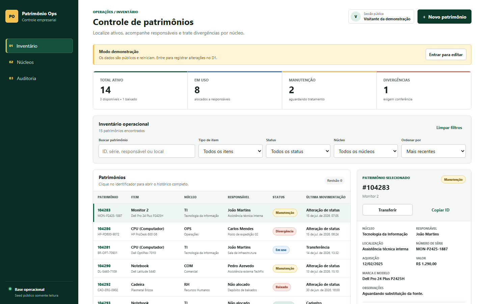

# Patrimônio Ops Control

Sistema web de controle patrimonial para empresas que precisam saber **qual ativo existe, onde está, a qual núcleo pertence e quem responde por ele**. O projeto cobre cadastro, alocação, transferências, manutenção, divergências, baixa lógica e trilha de auditoria.

[](https://github.com/Kenjihidehira/patrimonio-ops-control/actions/workflows/ci.yml)
[](https://patrimonio-ops-control.dadosepesquisa.chatgpt.site/demo/)
[](LICENSE)

**Demo pública:** [patrimonio-ops-control.dadosepesquisa.chatgpt.site/demo](https://patrimonio-ops-control.dadosepesquisa.chatgpt.site/demo/)



## Problema comercial resolvido

Planilhas patrimoniais não registram bem responsabilidade, movimentações e exceções. O Patrimônio Ops centraliza ativos por núcleo e transforma cada alteração em um evento auditável, reduzindo retrabalho em inventários, onboarding, manutenção e desligamentos.

### Escopo funcional

- Identificadores únicos com exatamente 6 números.
- Tipos controlados: CPU (Computador), Monitor 1, Monitor 2, Cadeira e Notebook.
- Organização por núcleo, gestor, responsável e localização física.
- Busca por ID, série, modelo, pessoa, local ou núcleo.
- Filtros de tipo, status e núcleo, com ordenação operacional.
- Cadastro de patrimônio e núcleo com validação no cliente e no domínio.
- Transferência entre núcleos, locais e responsáveis.
- Status: disponível, em uso, manutenção, divergência e baixado.
- Baixa lógica, sem exclusão destrutiva do histórico.
- Auditoria com ator, data, origem, destino e motivo.
- Dados públicos de demonstração e persistência D1 para sessões autenticadas.

## Stack

- **Frontend:** HTML semântico, CSS responsivo e JavaScript modular.
- **Aplicação:** Vinext, React 19 e TypeScript.
- **API:** Route Handler compatível com Next.js, executado em Cloudflare Worker.
- **Banco:** Cloudflare D1 com Drizzle ORM e migration reversível.
- **Autenticação:** Sign in with ChatGPT no ambiente OpenAI Sites.
- **Qualidade:** Node Test Runner, ESLint, TypeScript e GitHub Actions.

## Executar localmente

Pré-requisitos: Node.js 22.13+ e pnpm 10+.

```bash
pnpm install
pnpm dev
```

Acesse `http://localhost:5173/demo/`. Localmente, a interface pública funciona com o seed. Escritas exigem os cabeçalhos de identidade injetados pelo ambiente OpenAI Sites e persistência D1.

### Validação completa

```bash
pnpm test
pnpm lint
pnpm typecheck
pnpm build
```

## Dados de demonstração

O arquivo [`data/seed.json`](data/seed.json) contém 15 ativos distribuídos em Tecnologia da Informação, Financeiro, Operações, Comercial e Recursos Humanos. Há exemplos de todos os tipos e status, além de movimentações anteriores.

Nenhum dado pessoal real, segredo ou credencial está incluído.

## API

| Método | Rota | Autenticação | Finalidade |
| --- | --- | --- | --- |
| `GET` | `/api/state` | Opcional | Dashboard, inventário filtrado, núcleos, auditoria e sessão |
| `POST` | `/api/state` | Obrigatória | Cadastro, transferência, mudança de status ou novo núcleo |

Filtros aceitos no `GET`: `search`, `type`, `status`, `nucleus` e `sort`. Payloads e códigos de resposta estão em [`docs/api.md`](docs/api.md).

## Arquitetura e segurança

As regras ficam em [`lib/domain.js`](lib/domain.js), independentes de HTTP e banco. Toda mutação passa por normalização, validação e geração de movimento antes do `upsert` atômico no D1. A API não confia na identidade enviada pelo navegador: o ator vem do cabeçalho autenticado injetado pela plataforma.

Documentação completa: [`docs/architecture.md`](docs/architecture.md).

### Limitação consciente do deploy de portfólio

O deploy público usa um workspace compartilhado de demonstração. Qualquer visitante autenticado pelo ChatGPT pode editar esse workspace. Para operação real, é obrigatório adicionar convite, associação usuário-empresa e RBAC antes de armazenar dados de clientes. A arquitetura separa o domínio da persistência para permitir essa evolução sem reescrever as regras patrimoniais.

## Decisões de UX

A interface segue o padrão `list report + object detail`, comum em sistemas corporativos: busca e filtros agrupados, tabela densa, seleção de linha, detalhe contextual e ações progressivas. As referências usadas foram:

- [SAP Fiori - List Report](https://experience.sap.com/fiori-design-web/v1-46/list-report-floorplan-sap-fiori-element/)
- [IBM Carbon - Data Table](https://carbondesignsystem.com/components/data-table/usage/)
- [Atlassian Design System - Dynamic Table](https://atlassian.design/components/dynamic-table)
- [Shopify Polaris - Index Filters](https://polaris-react.shopify.com/components/selection-and-input/index-filters)

## Deploy

O projeto está configurado para OpenAI Sites com binding D1 em [`.openai/hosting.json`](.openai/hosting.json). O procedimento reproduzível e os controles de pré-publicação estão em [`docs/deploy.md`](docs/deploy.md).

## Diferenciais comerciais

- Fluxo demonstrável com problema empresarial real, não apenas CRUD genérico.
- Histórico imutável das decisões que alteram posse e estado do ativo.
- Regras críticas testadas separadamente da interface.
- Estados de carregamento, erro, vazio e sessão sem escrita implementados.
- Responsividade para operação em desktop, tablet e celular.
- CI e documentação suficientes para manutenção por outra equipe.

## Evoluções possíveis

- RBAC por empresa, núcleo e função.
- Importação e exportação CSV/XLSX com pré-validação.
- Etiquetas QR Code e leitura por câmera.
- Termo digital de responsabilidade e aceite do colaborador.
- Anexos de nota fiscal, laudo e foto do ativo em R2.
- Inventário cíclico com conferência offline e reconciliação.
- Integrações com RH, chamados de manutenção e diretório corporativo.

## Licença

[MIT](LICENSE)
