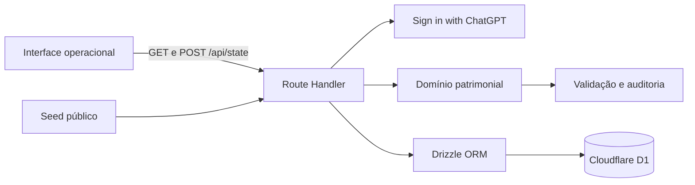

# Arquitetura

## Visão geral

## Responsabilidades

| Camada | Arquivos | Responsabilidade |
| --- | --- | --- |
| Interface | `public/demo/*` | Estado visual, filtros, formulários, acessibilidade e chamadas HTTP |
| API | `app/api/state/route.ts` | Sessão, contratos HTTP, carga e persistência |
| Domínio | `lib/domain.js` | Invariantes, ações, auditoria e projeção do dashboard |
| Dados | `db/*`, `data/seed.json` | Schema D1, migration e demonstração pública |
| Plataforma | `worker/*`, `build/*`, `.openai/*` | Execução no Worker e configuração de hosting |

## Invariantes do domínio

1. O identificador do patrimônio contém exatamente seis dígitos e é único.
2. O tipo pertence ao catálogo fechado de cinco itens.
3. Todo patrimônio referencia um núcleo existente.
4. Toda mutação incrementa a revisão do workspace.
5. Transferências e mudanças de status geram movimentação com ator e data.
6. Patrimônio baixado não pode ser transferido.
7. Baixa é lógica; o registro e seu histórico não são apagados.
8. Valores monetários e datas são normalizados antes da persistência.

## Modelo de persistência

O D1 mantém um documento JSON por `workspace_key`. A escolha é proporcional ao escopo do demo: o estado completo é validado antes de um único `upsert`, evitando persistências parciais entre ativo e histórico.

Para escala operacional maior, a evolução natural é normalizar em tabelas `companies`, `memberships`, `nuclei`, `assets` e `movements`, com índices em `company_id`, `asset_code`, `status`, `nucleus_id` e `occurred_at`.

## Fluxos de dados

### Leitura anônima

1. A API não encontra identidade autenticada.
2. Carrega e valida `data/seed.json`.
3. Aplica busca, filtros e ordenação no domínio.
4. Retorna o dashboard com `session.source = seed`.

### Leitura autenticada

1. A plataforma injeta cabeçalhos de identidade confiáveis.
2. A API busca o workspace compartilhado `company-demo` no D1.
3. Na ausência de registro, inicia com o seed validado.
4. Retorna o dashboard com `session.source = d1`.

### Mutação

1. A API bloqueia requisições sem identidade com `401`.
2. O domínio valida a ação e produz um novo estado sem mutar o anterior.
3. O ator da auditoria é o e-mail autenticado, não um campo do payload.
4. O estado completo é salvo com `INSERT ... ON CONFLICT DO UPDATE`.
5. A interface recarrega a projeção filtrada após a confirmação.

## Segurança

- Sem secrets no repositório ou no cliente.
- Sem confiança em identidade informada no payload.
- Redirects de autenticação restritos a caminhos relativos seguros.
- Erros internos não são expostos ao navegador.
- Conteúdo dinâmico é escapado antes de entrar em templates HTML.
- Escritas exigem autenticação; leitura pública contém apenas dados fictícios.
- Não existe exclusão física exposta pela API.
- CI possui permissões mínimas de leitura.

## Limitações e evolução produtiva

O workspace de demonstração é compartilhado entre usuários autenticados e não implementa autorização por empresa. Isso é adequado para prova pública, mas insuficiente para produção. A próxima etapa deve criar associação entre identidade, empresa e função, impedindo acesso cruzado e separando dados por tenant.

Também não há controle de concorrência otimista por revisão. Em uma implantação multiusuário real, o `POST` deve receber a revisão conhecida e rejeitar atualização obsoleta com `409 Conflict`, ou migrar cada ação para tabelas relacionais transacionais.

## Decisões registradas

### ADR-001: baixa lógica em vez de exclusão

**Decisão:** representar a baixa pelo status `retired`.

**Motivo:** patrimônio exige rastreabilidade fiscal e operacional. Excluir o registro destruiria evidência e enfraqueceria auditorias.

### ADR-002: domínio independente de framework

**Decisão:** manter validação e ações em JavaScript puro.

**Motivo:** testes rápidos, portabilidade e separação entre regra de negócio, HTTP e D1.

### ADR-003: workspace compartilhado no demo

**Decisão:** usar uma chave empresarial fixa no portfólio, preservando o ator individual na auditoria.

**Motivo:** demonstra colaboração real entre usuários, mas a limitação de RBAC está explicitamente documentada.
