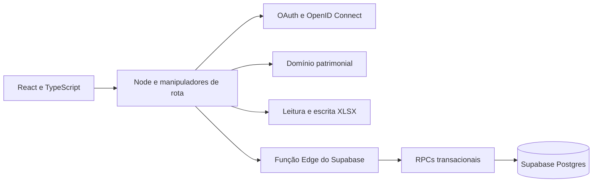

# Arquitetura

## Visão geral

O navegador nunca recebe a URL privilegiada nem o segredo do serviço intermediário. A API do Cloudflare Worker chama a Função Edge pelo servidor, e a função executa apenas as operações permitidas contra o Postgres.

## Responsabilidades

| Camada | Arquivos | Responsabilidade |
| --- | --- | --- |
| Interface | `app/demo/*`, `app/login/*`, `components/patrimonio/*` | Rotas React, estado visual, filtros, formulários, acessibilidade e cliente HTTP tipado |
| API | `app/api/*` | Sessão, contratos HTTP, recebimento de arquivos, exportação e respostas padronizadas |
| Domínio | `lib/domain.js` | Invariantes, ações, auditoria e projeção do painel |
| Planilhas | `lib/spreadsheet-import.js`, `lib/workbook.ts` | Leitura, normalização, prévia e geração XLSX |
| Identidade | `app/auth.ts`, `app/*-auth.ts`, `app/api/auth/*` | OAuth/OIDC, PKCE, validação de tokens, allowlists e sessão local comum |
| Persistência | `lib/supabase.ts`, `lib/workspace.ts` | Chave empresarial, serviço intermediário e hidratação do estado |
| Banco | `supabase/migrations/*` | Tabelas, índices, RLS, RPCs e integridade referencial |
| Serviço intermediário | `supabase/functions/patrimonio-gateway/index.ts` | Autenticação servidor-servidor e lista fechada de operações |
| Plataforma | `wrangler.jsonc`, `worker/index.ts` | Configuração do Worker, arquivos estáticos e variáveis do ambiente de execução |

## Arquitetura React

- `PatrimonioApp.tsx` compõe navegação, sincronização, comandos e janelas operacionais.
- `InventoryView.tsx`, `NucleiView.tsx`, `CollaboratorsView.tsx` e `OperationalViews.tsx` isolam cada fluxo de negócio.
- `Dialogs.tsx` concentra formulários e janelas modais reutilizando validações e contratos de comando.
- `hooks.ts` controla leitura abortável, sincronização periódica, tema e captura do leitor HID.
- `api.ts` é a única fronteira HTTP do navegador; componentes não conhecem credenciais nem detalhes do Supabase.
- `types.ts` formaliza a projeção devolvida pela API e reduz divergências entre filtros, formulários e respostas.

O estado operacional permanece no servidor. O navegador mantém apenas estado efêmero de tela e o cookie não sensível de tema; não há persistência em `localStorage` ou `sessionStorage`.

## Invariantes do domínio

1. O patrimônio oficial contém exatamente seis dígitos; itens ainda não etiquetados usam uma referência interna única iniciada por `S` e nunca são exibidos como patrimônio oficial.
2. O tipo pertence ao catálogo fechado de cinco itens.
3. Todo patrimônio referencia um núcleo existente.
4. Toda mutação incrementa a revisão do ambiente empresarial.
5. Transferências, mudanças de status, alterações de patrimônio e importações geram movimentos auditáveis.
6. Patrimônio baixado não pode ser transferido.
7. A edição cadastral altera apenas tipo, modelo, série, responsável, localização, aquisição e observações; número patrimonial, núcleo e status usam comandos específicos.
8. Baixa é lógica; o registro e seu histórico não são apagados.
9. Datas são normalizadas antes da persistência; preços não fazem parte da experiência operacional.
10. Uma revisão obsoleta não pode sobrescrever uma revisão mais nova.
11. A contagem de colaboradores deriva dos nomes distintos e não vazios no campo `Responsável` dos itens ativos; perfis sem atribuição atual não aumentam o total.
12. A sigla identifica o núcleo durante a reconciliação de importações; IDs internos não são assumidos como estáveis.
13. Renomear um colaborador preserva suas atribuições; um responsável ainda sem perfil pode ser cadastrado a partir do inventário, e mudar seu núcleo não transfere patrimônios sem auditoria.
14. `x` representa ausência de item; `Sem patrimônio` representa um item físico existente que deve permanecer no inventário como divergência.
15. Alterar o número patrimonial exige seis dígitos, unicidade e motivo; a identidade relacional dos movimentos existentes é preservada por cascata.
16. A leitura por bipador aceita apenas identificadores válidos recebidos como teclado HID; ela consulta a API autenticada e abre uma janela de conferência. Mudanças de status continuam exigindo motivo e passam pelo comando auditável `update_status`.

## Modelo de persistência

O Postgres usa sete tabelas relacionais:

| Tabela | Finalidade |
| --- | --- |
| `patrimonio_workspaces` | Base empresarial identificada por chave aleatória e contador de revisão |
| `patrimonio_nuclei` | Núcleos, gestores e localizações |
| `patrimonio_assets` | Inventário, estado operacional e dados de aquisição |
| `patrimonio_asset_aliases` | Referências anteriores usadas para reconciliar reimportações após renumeração |
| `patrimonio_collaborators` | Perfis complementares dos responsáveis e vínculo atual com o núcleo |
| `patrimonio_movements` | Histórico imutável de cadastro, transferência, status e importação |
| `patrimonio_import_runs` | Resultado e avisos de cada importação |

Chaves estrangeiras preservam integridade e índices cobrem status, núcleo, tipo, responsável, atualização, movimentos e histórico de importações. As RPCs `patrimonio_apply_action` e `patrimonio_import_workspace` executam validação de revisão, escrita e auditoria na mesma transação.

## Fluxos de dados

### Leitura anônima

1. A API não encontra identidade autenticada.
2. Cria uma projeção vazia, sem dados patrimoniais.
3. Retorna `session.source = locked`; leitura empresarial, exportação e escrita permanecem bloqueadas.

### Leitura autenticada

1. A API inicia Authorization Code com `state` e PKCE; Google também recebe um `nonce` OIDC.
2. GitHub ou Google autenticam a conta e devolvem o código para a URL de retorno registrada.
3. GitHub é validado pela API `/user`; Google tem o ID token validado por JWKS, emissor, audiência e `nonce`.
4. A política local restringe GitHub por login e Google por e-mail exato.
5. Uma sessão local assinada, `HttpOnly`, `Secure` e `SameSite=Lax` mantém apenas provedor, nome e identificador do usuário por oito horas.
6. A API usa `PATRIMONIO_WORKSPACE_KEY` para carregar a base empresarial compartilhada e retorna `session.source = supabase`.

### Mutação

1. A API bloqueia requisições sem identidade com `401`.
2. O cliente envia `expectedRevision`.
3. O domínio valida a ação antes da chamada externa.
4. A RPC bloqueia a linha do ambiente empresarial, compara a revisão e grava dados e auditoria atomicamente.
5. Revisão divergente retorna `409 Conflict`; sucesso devolve a nova projeção.

### Importação XLSX

1. A API aceita apenas `.xlsx` de até 2 MB.
2. A prévia reconhece a matriz original ou o formato plano exportado.
3. IDs de cinco dígitos recebem zero à esquerda; inválidos e todas as ocorrências duplicadas são rejeitados.
4. A confirmação reprocessa o arquivo no servidor e chama uma RPC transacional.
5. Núcleos são reconciliados por sigla e seus IDs persistidos são resolvidos antes dos demais vínculos.
6. Ativos e colaboradores são sincronizados, movimentos são adicionados e o resultado é registrado.

### Exportação XLSX

1. O ambiente empresarial atual é projetado pelo domínio.
2. O servidor gera as abas `Inventário`, `Núcleos`, `Auditoria` e `Importações`.
3. O arquivo é entregue com `no-store`, `nosniff` e nome datado.

## Segurança

- Nenhum segredo é versionado ou exposto ao cliente.
- Nenhum patrimônio, núcleo, colaborador ou evento da planilha é devolvido sem autenticação.
- O ator vem da sessão de identidade validada e inclui o provedor, nunca do corpo da requisição enviado pelo cliente.
- A chave empresarial é aleatória, tem 256 bits e permanece somente no ambiente de execução do servidor.
- `state` e PKCE protegem os dois fluxos; Google também valida `nonce` para impedir a repetição indevida do token de identidade.
- O token de acesso e o segredo do cliente nunca são enviados ao JavaScript da interface nem gravados na sessão local.
- O serviço intermediário aceita somente operações enumeradas e exige `x-patrimonio-key`.
- RLS está habilitado e políticas negam acesso direto a `anon` e `authenticated`.
- O envio de arquivo tem limite de tamanho, extensão controlada e analisador estruturado.
- A prévia não devolve nomes dos colaboradores da planilha.
- Redirecionamentos de autenticação são restritos a caminhos relativos seguros.
- Erros internos e detalhes do banco não são expostos ao navegador.
- Conteúdo dinâmico é escapado antes de entrar em templates HTML.
- A preferência de tema usa somente o cookie não sensível `patrimonio_theme`; dados operacionais não são persistidos no navegador.
- Filtros rápidos, paginação e abas de detalhe são estado efêmero da interface; filtros estruturais continuam sendo processados pela API.
- A captura do bipador ignora campos editáveis, exige um terminador `Enter` ou `Tab` e não usa WebUSB, Web Serial nem permissões privilegiadas do navegador.
- Não existe exclusão física exposta pela API.

## Limitações e evolução produtiva

O ambiente empresarial atual representa uma empresa e é compartilhado por todos os logins presentes na lista de autorizados. A sessão identifica o ator da auditoria, mas todos possuem as mesmas permissões. Para múltiplas empresas ou perfis distintos, o próximo incremento deve introduzir `organizations`, `memberships` e papéis como administrador, operador e auditor.

Também faltam recuperação de desastre automatizada, política formal de retenção e armazenamento de anexos. A exportação XLSX reduz o risco operacional, mas não substitui uma cópia de segurança gerenciada do Postgres.

## Decisões registradas

### ADR-001: baixa lógica em vez de exclusão

**Decisão:** representar a baixa pelo status `retired`.

**Motivo:** patrimônio exige rastreabilidade fiscal e operacional. Excluir o registro destruiria evidência.

### ADR-002: domínio independente de arcabouço de aplicação

**Decisão:** manter validação e ações em JavaScript puro.

**Motivo:** testes rápidos, portabilidade e separação entre regra de negócio, HTTP e persistência.

### ADR-003: Postgres relacional e RPCs transacionais

**Decisão:** persistir núcleos, ativos, movimentos e importações em tabelas normalizadas; mutações passam por RPC.

**Motivo:** integridade referencial, consultas indexadas e atomicidade são requisitos reais do fluxo patrimonial.

### ADR-004: serviço intermediário servidor-servidor

**Decisão:** manter as tabelas fechadas para chaves públicas e expor uma Função Edge mínima à API do Cloudflare Worker.

**Motivo:** a integração de publicação não deve colocar uma chave privilegiada no navegador nem depender de identidade forjada pelo cliente.

### ADR-005: múltiplos provedores com sessão local mínima

**Decisão:** usar OAuth/OIDC Authorization Code com PKCE, validar a identidade no provedor e converter somente contas autorizadas em uma sessão curta comum assinada pela aplicação.

**Motivo:** aceitar identidades GitHub e Google sem criar senhas locais, sem persistir tokens dos provedores e sem duplicar a autorização nas rotas de negócio.

### ADR-006: ambiente empresarial compartilhado

**Decisão:** usar uma chave aleatória secreta por empresa em vez de derivar o ambiente do e-mail de cada usuário.

**Motivo:** os operadores autorizados precisam colaborar sobre o mesmo inventário; a identidade individual continua registrada como ator de cada movimento.

### ADR-007: número patrimonial mutável com auditoria

**Decisão:** permitir a correção da chave `(owner_key, code)` somente pela RPC transacional, usando `ON UPDATE CASCADE` para preservar os movimentos e adicionando um evento `identifier_change`.

**Motivo:** o número da etiqueta pode ser corrigido ou atribuído depois da importação, mas editar diretamente a chave quebraria rastreabilidade e poderia deixar referências órfãs.

### ADR-008: alias persistente para reconciliação de importações

**Decisão:** guardar cada identificador anterior em `patrimonio_asset_aliases` e substituir a referência pelo patrimônio atual antes da inserção ou atualização dos dados da planilha.

**Motivo:** a planilha de origem pode continuar com `Sem patrimônio` após a etiqueta ser aplicada no sistema. Sem o alias, uma reimportação criaria um segundo registro para a mesma peça física e reabriria a divergência já resolvida.
