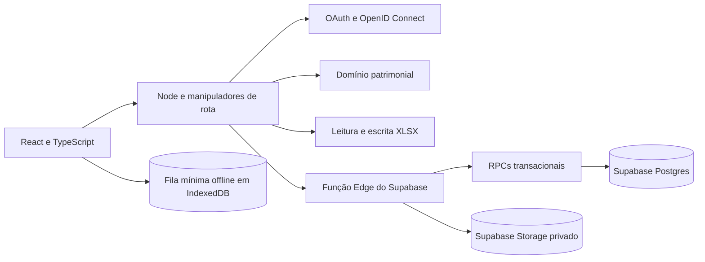

# Arquitetura

## Visão geral

```mermaid
flowchart LR
    UI[React e TypeScript] --> API[Node e manipuladores de rota]
    API --> AUTH[OAuth e OpenID Connect]
    API --> DOMAIN[Domínio patrimonial]
    API --> XLSX[Leitura e escrita XLSX]
    API --> GATEWAY[Função Edge do Supabase]
    GATEWAY --> RPC[RPCs transacionais]
    RPC --> PG[(Supabase Postgres)]
    GATEWAY --> STORAGE[(Supabase Storage privado)]
    UI --> IDB[(Fila mínima offline em IndexedDB)]
```

O navegador nunca recebe a URL privilegiada nem o segredo do serviço intermediário. A API do Cloudflare Worker chama a Função Edge pelo servidor, e a função executa apenas as operações permitidas contra o Postgres.

## Responsabilidades

| Camada | Arquivos | Responsabilidade |
| --- | --- | --- |
| Interface | `app/demo/*`, `app/login/*`, `components/patrimonio/*` | Rotas React, estado visual, filtros, formulários, acessibilidade e cliente HTTP tipado |
| API | `app/api/*` | Sessão, contratos HTTP, recebimento de arquivos, exportação e respostas padronizadas |
| Domínio | `lib/domain.js` | Invariantes, ações, auditoria e projeção do painel |
| Planilhas | `lib/spreadsheet-import.js`, `lib/workbook.ts`, `scripts/prepare-sabium-import.mjs` | Leitura, normalização, prévia, preparação Sabium e geração XLSX |
| Identidade | `app/auth.ts`, `app/*-auth.ts`, `app/api/auth/*` | OAuth/OIDC, PKCE, validação de tokens, allowlists e sessão local comum |
| Persistência | `lib/supabase.ts`, `lib/workspace.ts` | Chave empresarial, serviço intermediário e hidratação do estado |
| Banco | `supabase/migrations/*` | Tabelas, índices, RLS, RPCs e integridade referencial |
| Serviço intermediário | `supabase/functions/patrimonio-gateway/index.ts` | Autenticação servidor-servidor e lista fechada de operações |
| Plataforma | `wrangler.jsonc`, `worker/index.ts` | Configuração do Worker, arquivos estáticos e variáveis do ambiente de execução |

## Arquitetura React

- `PatrimonioApp.tsx` compõe navegação, sincronização, comandos e janelas operacionais.
- `InventoryView.tsx`, `NucleiView.tsx`, `CollaboratorsView.tsx` e `OperationalViews.tsx` isolam os fluxos cadastrais.
- `OperationsCenterView.tsx` e `components/patrimonio/operations/*` implementam inventário cíclico, custódia, manutenção, rastreamento, ciclo de vida, documentos e integrações.
- `Dialogs.tsx` concentra formulários e janelas modais reutilizando validações e contratos de comando.
- `hooks.ts` controla leitura abortável, sincronização periódica, tema e captura do leitor HID.
- `api.ts` é a única fronteira HTTP do navegador; componentes não conhecem credenciais nem detalhes do Supabase.
- `types.ts` formaliza a projeção devolvida pela API e reduz divergências entre filtros, formulários e respostas.

O estado autoritativo permanece no servidor. O navegador mantém estado efêmero de tela, o cookie não sensível de tema e, somente durante inventário sem conexão, uma fila IndexedDB com departamento, campanha, ativo, resultado, local, observação e horário. Não há persistência em `localStorage` ou `sessionStorage`, nem cópia local de nomes, séries, modelos ou documentos.

## Invariantes do domínio

1. O patrimônio convencional contém seis dígitos, a frota usa `número-da-frota.0` e itens ainda não etiquetados usam uma referência interna única iniciada por `S`.
2. O tipo pertence ao catálogo fechado de bens de TI, frota, veículos, componentes, equipamentos, móveis, extintores, software e outros bens.
3. Todo patrimônio referencia um núcleo existente.
4. Toda mutação incrementa a revisão do ambiente empresarial.
5. Transferências, mudanças de status, alterações de patrimônio e importações geram movimentos auditáveis.
6. Patrimônio baixado não pode ser transferido.
7. A edição cadastral altera apenas tipo, modelo, série, responsável, localização, aquisição e observações; número patrimonial, núcleo e status usam comandos específicos.
8. Baixa é lógica; o registro e seu histórico não são apagados.
9. Datas são normalizadas antes da persistência; preços não aparecem no inventário comum e dados contábeis são restritos a administradores.
10. Uma revisão obsoleta não pode sobrescrever uma revisão mais nova.
11. A contagem de colaboradores deriva dos nomes distintos e não vazios no campo `Responsável` dos itens ativos; perfis sem atribuição atual não aumentam o total.
12. A sigla identifica o núcleo durante a reconciliação de importações; IDs internos não são assumidos como estáveis.
13. Renomear um colaborador preserva suas atribuições; um responsável ainda sem perfil pode ser cadastrado a partir do inventário, e mudar seu núcleo não transfere patrimônios sem auditoria.
14. `x` representa ausência de item; `Sem patrimônio` representa um item físico existente que deve permanecer no inventário como divergência.
15. Alterar o número patrimonial exige formato compatível com o tipo, unicidade e motivo; identificadores Sabium não aceitam edição manual e a identidade relacional dos movimentos existentes é preservada por cascata.
16. A leitura por bipador ou câmera aceita identificadores convencionais, de frota, Sabium ou internos válidos; a câmera usa QR ou código de barras e a consulta permanece autenticada.
17. Campanhas, custódia, manutenção, rastreamento e recursos avançados passam por RPCs transacionais, respeitam a revisão do workspace e registram ator e horário.
18. Documento patrimonial é privado, possui checksum e só pode ser aberto por URL assinada depois de nova autorização.

## Modelo de persistência

O Postgres organiza a persistência em grupos relacionais:

| Tabela | Finalidade |
| --- | --- |
| `patrimonio_workspaces` | Base empresarial identificada por chave aleatória e contador de revisão |
| `patrimonio_nuclei` | Núcleos, gestores e localizações |
| `patrimonio_assets` | Inventário, estado operacional e dados de aquisição |
| `patrimonio_asset_aliases` | Referências anteriores usadas para reconciliar reimportações após renumeração |
| `patrimonio_collaborators` | Perfis complementares dos responsáveis e vínculo atual com o núcleo |
| `patrimonio_movements` | Histórico imutável de cadastro, transferência, status e importação |
| `patrimonio_import_runs` | Resultado e avisos de cada importação |
| `patrimonio_inventory_campaigns`, `patrimonio_inventory_campaign_assets` | Campanhas de contagem e resultado por item |
| `patrimonio_custody_terms`, `patrimonio_maintenance_orders` | Responsabilidade formal e ordens de serviço |
| `patrimonio_tracking_tags`, `patrimonio_tracking_events` | Tags e telemetria recebida de dispositivos |
| `patrimonio_asset_documents`, `patrimonio_asset_contracts`, `patrimonio_asset_accounting` | Arquivo privado, vigências e dados contábeis |
| `patrimonio_asset_kits`, `patrimonio_reservations`, `patrimonio_offboarding_cases` | Kits, agenda de equipamentos e recolhimentos |
| `patrimonio_lifecycle_requests`, `patrimonio_custom_fields` | Aprovações e extensão controlada do cadastro |
| `patrimonio_integrations`, `patrimonio_integration_events`, `patrimonio_reconciliation_issues` | Conectores, idempotência e conciliação |
| `patrimonio_asset_inspections` | Fila, resultado e revisão de inspeções fotográficas |

Chaves estrangeiras preservam integridade e índices cobrem status, núcleo, tipo, responsável, datas e filas operacionais. As RPCs `patrimonio_apply_action`, `patrimonio_apply_operational_action`, `patrimonio_apply_advanced_action` e `patrimonio_import_workspace` executam autorização interna, revisão, escrita e auditoria na mesma transação. `patrimonio_load_advanced_context` agrega o contexto avançado e remove finanças e integrações da resposta de perfis não administrativos.

## Fluxos de dados

### Acesso sem sessão

1. A rota `/demo` não encontra identidade autenticada e redireciona para `/login?return_to=%2Fdemo` antes de renderizar o painel.
2. A API acessada diretamente responde `401` e informa somente a URL local de login.
3. Se a sessão expirar durante a sincronização, o cliente substitui a navegação pelo login sem tentar renderizar um ambiente incompleto.

### Leitura autenticada

1. A API inicia Authorization Code com `state`, PKCE e `nonce` OIDC.
2. O Google autentica a conta e devolve o código para a URL de retorno registrada.
3. O ID token é validado por JWKS, emissor, audiência e `nonce`.
4. O gateway confirma que o e-mail está ativo na tabela de usuários.
5. Uma sessão local assinada, `HttpOnly`, `Secure` e `SameSite=Lax` mantém apenas provedor, nome e identificador do usuário por oito horas.
6. A API envia identidade e departamento solicitado; o gateway valida a associação e resolve a chave interna do ambiente.
7. Sincronizações em segundo plano enviam a revisão conhecida. Se não houve
   mutação, o gateway devolve apenas `notModified` e a API responde `304`,
   evitando reler todo o inventário e o histórico.

### Mutação

1. A API bloqueia requisições sem identidade com `401`.
2. O cliente envia `expectedRevision`.
3. O domínio valida a ação antes da chamada externa.
4. A RPC bloqueia a linha do ambiente empresarial, compara a revisão e grava dados e auditoria atomicamente.
5. Revisão divergente retorna `409 Conflict`; sucesso devolve a nova projeção.

### Importação XLSX

1. A API aceita apenas `.xlsx` de até 2 MB.
2. A prévia reconhece a matriz original ou o formato plano exportado.
3. IDs de cinco dígitos recebem zero à esquerda; inválidos e todas as ocorrências duplicadas são rejeitados.
4. A confirmação reprocessa o arquivo no servidor e chama uma RPC transacional.
5. Núcleos são reconciliados por sigla e seus IDs persistidos são resolvidos antes dos demais vínculos.
6. Ativos e colaboradores são sincronizados, movimentos são adicionados e o resultado é registrado.

### Carga patrimonial Sabium

1. O utilitário administrativo valida o cabeçalho da exportação e normaliza datas, valores, descrições, grupos e filiais.
2. Cada linha recebe uma chave técnica `G...` e um fingerprint SHA-256 determinístico; o identificador exibido continua sendo o código de origem Sabium.
3. A RPC `patrimonio_import_sabium_assets` aceita somente `service_role`, resolve internamente o workspace `gazin-log` e rejeita metadados incompletos.
4. A chave técnica e o fingerprint impedem colisões; código-base e incorporação distinguem registros que compartilham o mesmo identificador visível.
5. Valores de aquisição, operação e nota fiscal são removidos da projeção de usuários não administradores.

### Exportação XLSX

1. O ambiente empresarial atual é projetado pelo domínio.
2. O servidor gera as abas `Inventário`, `Núcleos`, `Auditoria` e `Importações`.
3. O arquivo é entregue com `no-store`, `nosniff` e nome datado.

### Inventário com contingência offline

1. O operador seleciona uma campanha ativa e lê a etiqueta por HID, câmera ou digitação.
2. Com conexão, a conferência é registrada imediatamente pela RPC operacional.
3. Sem conexão, somente o registro mínimo é enfileirado no IndexedDB do dispositivo.
4. A sincronização envia um lote com a revisão atual; itens só são removidos localmente depois da confirmação do servidor.
5. Conflito de revisão mantém a fila intacta para recarga e nova tentativa.

### Documento privado

1. A rota autentica o usuário, valida departamento, tipo e tamanho antes do envio.
2. O gateway repete as validações, grava em caminho não previsível no bucket privado e calcula SHA-256.
3. A RPC registra metadados e revisão; se falhar, o objeto recém-enviado é removido.
4. A abertura exige nova autorização e usa URL assinada por 60 segundos.

## Segurança

- Nenhum segredo é versionado ou exposto ao cliente.
- Nenhum patrimônio, núcleo, colaborador ou evento da planilha é devolvido sem autenticação.
- O ator vem da sessão de identidade validada e inclui o provedor, nunca do corpo da requisição enviado pelo cliente.
- A chave empresarial é aleatória, tem 256 bits e permanece somente no ambiente de execução do servidor.
- `state`, PKCE e `nonce` protegem o fluxo contra falsificação de requisição, interceptação do código e repetição indevida do token de identidade.
- O token de acesso e o segredo do cliente nunca são enviados ao JavaScript da interface nem gravados na sessão local.
- O serviço intermediário aceita somente operações enumeradas e exige assinatura HMAC sobre o corpo, timestamp dentro da janela permitida e nonce de uso único.
- RLS está habilitado e políticas negam acesso direto a `anon` e `authenticated`.
- O envio de arquivo tem limite de tamanho, extensão controlada e analisador estruturado.
- A prévia não devolve nomes dos colaboradores da planilha.
- Redirecionamentos de autenticação são restritos a caminhos relativos seguros.
- Erros internos e detalhes do banco não são expostos ao navegador.
- Conteúdo dinâmico é escapado antes de entrar em templates HTML.
- A preferência de tema usa somente o cookie não sensível `patrimonio_theme`; a única persistência operacional no navegador é a fila mínima e segregada de inventário offline.
- Filtros rápidos, paginação e abas de detalhe são estado efêmero da interface; filtros estruturais continuam sendo processados pela API.
- A captura do bipador ignora campos editáveis comuns, usa `Enter` ou `Tab` quando disponível e reconcilia a busca patrimonial exata como contingência para leitores sem terminador; não usa WebUSB, Web Serial nem permissões privilegiadas do navegador.
- A câmera é iniciada somente após ação do usuário, prioriza a lente traseira e também aceita imagem local; o fluxo não envia vídeo ao servidor.
- Documentos ficam em bucket privado com limite de tipo e tamanho, checksum e URL assinada curta.
- Configurações secretas de integrações não são devolvidas pela função de contexto.
- Não existe exclusão física exposta pela API.

## Limitações e evolução produtiva

Cada departamento possui workspace e chave próprios. Administradores globais acessam todos; demais usuários recebem associações explícitas e permissões independentes para alteração, importação e exportação. Mudanças de acesso revogam sessões anteriores e são registradas na auditoria administrativa.

Eventos técnicos vencidos possuem eliminação automática, mas o prazo dos registros patrimoniais depende da política corporativa e de obrigações legais. Backup gerenciado, RPO, RTO e teste de restauração ainda precisam ser confirmados no plano do Supabase. A exportação XLSX não substitui uma cópia de segurança gerenciada do Postgres.

Os conectores, chips e inspeções possuem contratos de ingestão e revisão implementados, mas a operação produtiva depende da homologação dos fornecedores escolhidos, de credenciais próprias e, no caso de RFID, NFC, BLE, UWB ou GPS, dos leitores e tags físicos correspondentes.

## Decisões registradas

### ADR-001: baixa lógica em vez de exclusão

**Decisão:** representar a baixa pelo status `retired`.

**Motivo:** patrimônio exige rastreabilidade fiscal e operacional. Excluir o registro destruiria evidência.

### ADR-002: domínio independente de arcabouço de aplicação

**Decisão:** manter validação e ações em JavaScript puro.

**Motivo:** testes rápidos, portabilidade e separação entre regra de negócio, HTTP e persistência.

### ADR-003: Postgres relacional e RPCs transacionais

**Decisão:** persistir núcleos, ativos, movimentos e importações em tabelas normalizadas; mutações passam por RPC.

**Motivo:** integridade referencial, consultas indexadas e atomicidade são requisitos reais do fluxo patrimonial.

### ADR-004: serviço intermediário servidor-servidor

**Decisão:** manter as tabelas fechadas para chaves públicas e expor uma Função Edge mínima à API do Cloudflare Worker.

**Motivo:** a integração de publicação não deve colocar uma chave privilegiada no navegador nem depender de identidade forjada pelo cliente.

### ADR-005: provedor externo com sessão local mínima

**Decisão:** usar OAuth/OIDC Authorization Code com PKCE, validar a identidade no provedor e converter somente contas autorizadas em uma sessão curta comum assinada pela aplicação.

**Motivo:** aceitar identidades Google autorizadas sem criar senhas locais, sem persistir tokens do provedor e sem duplicar a autorização nas rotas de negócio.

### ADR-006: ambiente empresarial compartilhado

**Decisão:** usar uma chave aleatória secreta por empresa em vez de derivar o ambiente do e-mail de cada usuário.

**Motivo:** os operadores autorizados precisam colaborar sobre o mesmo inventário; a identidade individual continua registrada como ator de cada movimento.

### ADR-007: número patrimonial mutável com auditoria

**Decisão:** permitir a correção da chave `(owner_key, code)` somente pela RPC transacional, usando `ON UPDATE CASCADE` para preservar os movimentos e adicionando um evento `identifier_change`.

**Motivo:** o número da etiqueta pode ser corrigido ou atribuído depois da importação, mas editar diretamente a chave quebraria rastreabilidade e poderia deixar referências órfãs.

### ADR-008: alias persistente para reconciliação de importações

**Decisão:** guardar cada identificador anterior em `patrimonio_asset_aliases` e substituir a referência pelo patrimônio atual antes da inserção ou atualização dos dados da planilha.

**Motivo:** a planilha de origem pode continuar com `Sem patrimônio` após a etiqueta ser aplicada no sistema. Sem o alias, uma reimportação criaria um segundo registro para a mesma peça física e reabriria a divergência já resolvida.
